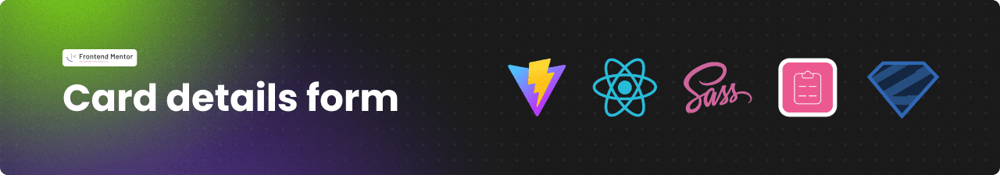
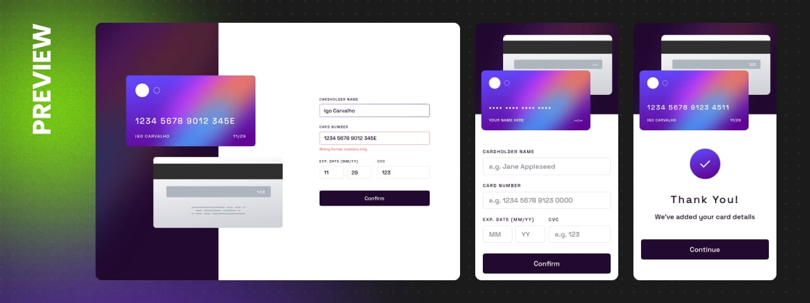

<h1 align="center">Frontend Mentor - Card details form</h1>



<p align="center">Essa é minha solução para o desafio Interactive card details form do site <a href="https://www.frontendmentor.io/challenges/interactive-card-details-form-XpS8cKZDWw">desafio Interactive card details form</a> do site Frontend Mentor.</p>

<h2 align="center">
  <a href="https://card-details-form-igo.netlify.app/">🔹 Acesse o site através deste link. 🔹</a>
</h2>

## :sparkles: O desafio

Os usuários devem ser capazes de:

- [x] Preencher o formulário e verem os dados no cartão se atualizarem em tempo real
- [x] Receber mensagens de erro quando o formulário for enviado, em caso de:
    - [x] Algum campo esteja vazio
    - [x] O número do cartão, data de vencimento ou CVC estão em um formato incorreto
- [x] Verem o layout ideal de acordo com o aparelho e tamanho de tela que estejam utilizando
- [x] Verem estados de `hover`, `ativo` e `focus` nos elementos interativos da página

## :framed_picture: Screenshots



## :computer: Tecnologias utilizadas

- [Vite](https://vitejs.dev/)
- [React](https://pt-br.reactjs.org/)
- [Typescript](https://www.typescriptlang.org/)
- [Sass](https://sass-lang.com/)
- [React Hook Form](https://react-hook-form.com/)
- [Zod](https://zod.dev/)

## :construction_worker: Como Executar

```bash
# Clone o repositório
git clone https://github.com/IgoCarvalho/frontend-mentor-challenges.git
```

```bash
# Entre na pasta do projeto
cd frontend-mentor-challenges/card-details-form
```

```bash
# Instale as dependências
yarn
```

```bash
# Execute o projeto
yarn dev
```

Pronto :tada: agora abra [http://localhost:5173](http://localhost:5173) em seu navegador favorito.

## :technologist: Autores

<table>
  <tr>
    <td align="center">
      <a href="https://github.com/IgoCarvalho">
        
        <br />
        <sub>
          <b>Igo Carvalho</b>
        </sub>
      </a>
      <br />
      <a href="https://www.linkedin.com/in/igocarvalho/" title="LinkedIn" target="_blank">@igocarvalho</a>
    </td>
    <td align="center">
      <a href="https://www.frontendmentor.io" target="_blank">
        
        <br>
        <sub>
          <b>Frontend Mentor</b>
        </sub>
      </a>
      <br />
      <a href="https://www.frontendmentor.io/challenges" title="Frontend Mentor Website" target="_blank">More Challenges</a>
    </td>
  </tr>
</table>

---

<p align="center">
  Feito com 💜 por <a href="https://github.com/IgoCarvalho">Igo Carvalho</a>
</p>
