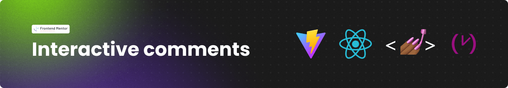
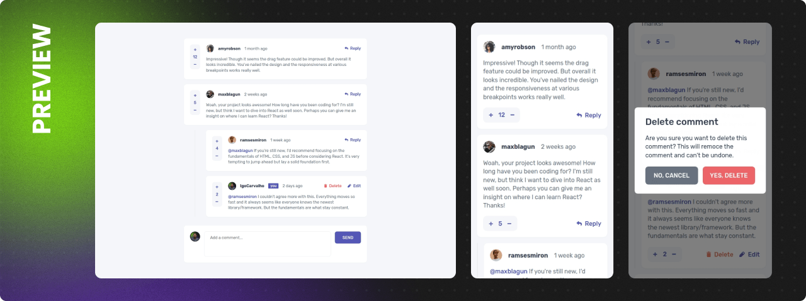

# Frontend Mentor - Multi-step form



## Essa é minha solução para o [desafio Multi-step form do site Frontend Mentor](https://www.frontendmentor.io/challenges/interactive-comments-section-iG1RugEG9).

> Você pode acessar o site desenvolvido através deste [**Link.**](https://interactive-comments-section-igo.netlify.app/)

## :sparkles: O desafio

Os usuários devem ser capazes de:

- [x] Criar, ler, atualizar, e deletar comentários e respostas
- [x] Aprovar ou reprovar comentários
- [x] Ver o layout ideal, dependendo do tamanho da tela do dispositivo
- [x] Ver efeitos de `hover` e `focus` para todos os elementos interativos da pagina

Comportamento esperado:

- [x] Os comentários devem ser ordenados por sua pontuação, enquanto as respostas são ordenadas pela data que foram adicionadas.
- [x] Um modal de confirmação deve aparecer antes que um comentário ou resposta seja excluído.
- [x] Você só pode editar ou excluir seus próprios comentários e respostas.

## :framed_picture: Screenshots



## :computer: Tecnologias

- [Vite](https://vitejs.dev/)
- [React](https://pt-br.reactjs.org/)
- [Styled Components](https://styled-components.com/)
- [Typescript](https://www.typescriptlang.org/)
- [Date-fns](https://date-fns.org/)

## :construction_worker: Como Executar

```bash
# Clone o repositório
git clone https://github.com/IgoCarvalho/frontend-mentor-challenges.git
```

```bash
# Entre na pasta do projeto
cd frontend-mentor-challenges/interactive-comments-section
```

```bash
# Instale as dependências
npm install
```

```bash
# Execute o projeto
npm run dev
```

**Pronto** :tada:

## :technologist: Autores

<table>
  <tr>
    <td align="center">
      <a href="https://github.com/IgoCarvalho">
        
        <br />
        <sub>
          <b>Igo Carvalho</b>
        </sub>
      </a>
      <br />
      <a href="https://www.linkedin.com/in/igocarvalho/" title="LinkedIn" target="_blank">@igocarvalho</a>
    </td>
    <td align="center">
      <a href="https://www.frontendmentor.io" target="_blank">
        
        <br>
        <sub>
          <b>Frontend Mentor</b>
        </sub>
      </a>
      <br />
      <a href="https://www.frontendmentor.io/challenges" title="Frontend Mentor Website" target="_blank">More Challenges</a>
    </td>
  </tr>
</table>

---

<p align="center">
  Feito com 💜 por <a href="https://github.com/IgoCarvalho">Igo Carvalho</a>
</p>
