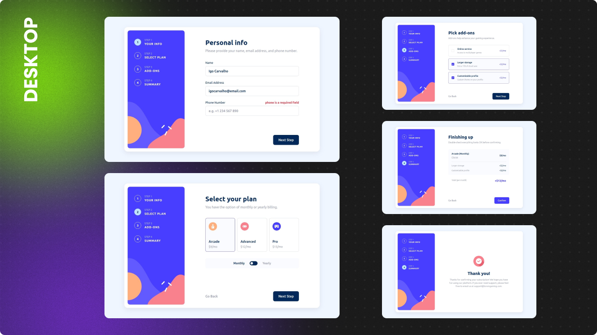
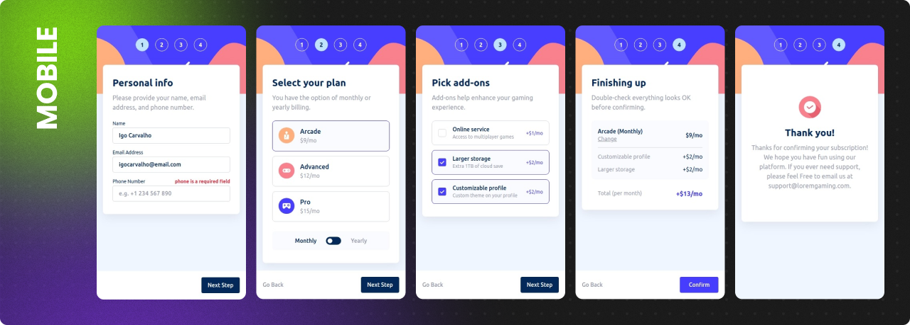

# Frontend Mentor - Multi-step form


> Essa é minha solução para o [desafio Multi-step form do site Frontend Mentor](https://www.frontendmentor.io/challenges/multistep-form-YVAnSdqQBJ).

## :sparkles: O desafio

Os usuários devem ser capazes de:

- [x] Completar cada etapa da sequencia
- [x] Ver um resumo das suas escolhas na etapa final e confirmar sua compra
- [x] Ver o layout ideal, dependendo do tamanho da tela do dispositivo
- [x] Ver efeitos de `hover` e `focus` para todos os elementos interativos da pagina

Funcionalidades extras:

- [x] Validação do formulário
  > O usuário sá pode passar para a próxima etapa do formulário se preencher corretamente cada etapa.
- [x] Transição na troca de etapa do formulário

## :framed_picture: Screenshots





## :computer: Tecnologias

- [Vite](https://vitejs.dev/)
- [Vue 3](https://vuejs.org/)
- [Typescript](https://www.typescriptlang.org/)
- [VeeValidate](https://vee-validate.logaretm.com/v4/)
- [Yup](https://github.com/jquense/yup)

## :construction_worker: Como Executar

```bash
# Clone o projeto
git clone https://github.com/IgoCarvalho/frontend-mentor-challenges.git
```

```bash
# Entre na pasta do projeto
cd multi-step-form
```

```bash
# Instale as dependências

# npm
npm install

# Yarn
yarn install
```

```bash
# Execute o projeto

# npm
npm run dev

# Yarn
yarn dev
```

Pronto :tada:

## :technologist: Autores

<table>
  <tr>
    <td align="center">
      <a href="https://github.com/IgoCarvalho">
        
        <br />
        <sub>
          <b>Igo Carvalho</b>
        </sub>
      </a>
      <br />
      <a href="https://www.linkedin.com/in/igocarvalho/" title="LinkedIn" target="_blank">@igocarvalho</a>
    </td>
    <td align="center">
      <a href="https://www.frontendmentor.io" target="_blank">
        
        <br>
        <sub>
          <b>Frontend Mentor</b>
        </sub>
      </a>
      <br />
      <a href="https://www.frontendmentor.io/challenges" title="Frontend Mentor Website" target="_blank">More Challenges</a>
    </td>
  </tr>
</table>

---

<p align="center">
  Feito com 💜 por <a href="https://github.com/IgoCarvalho">Igo Carvalho</a>
</p>
